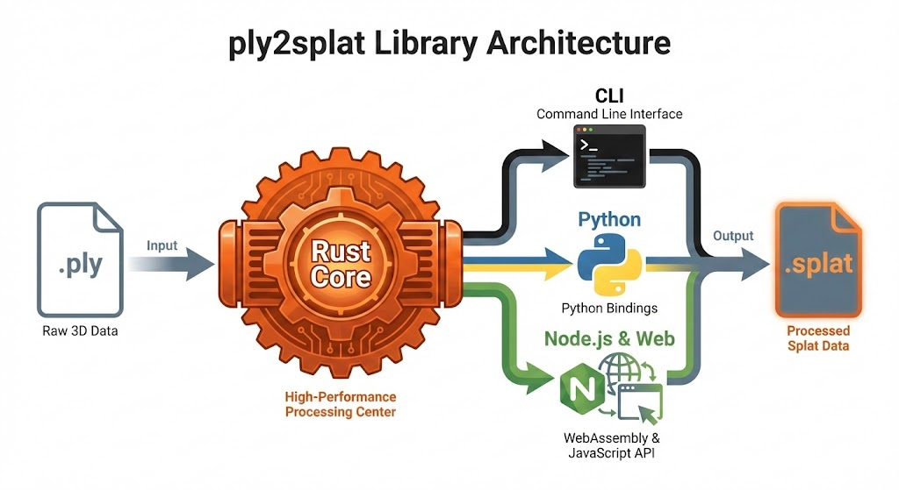

# ply2splat

[](https://crates.io/crates/ply2splat)
[](https://docs.rs/ply2splat)
[](https://pypi.org/project/ply2splat/)
[](https://www.npmjs.com/package/@ply2splat/native)
[](https://opensource.org/licenses/MIT)

A Rust crate and CLI tool for converting Gaussian Splatting `.ply` files to the `.splat` format.

Available on [crates.io](https://crates.io/crates/ply2splat) for Rust, [PyPI](https://pypi.org/project/ply2splat/) for Python, and [npm](https://www.npmjs.com/package/@ply2splat/native) for JavaScript/TypeScript (Node.js & Web).



## Workspace Architecture

This repository is organized as a Cargo workspace:

```
.
├── crates/
│   ├── ply2splat/         # Core library and CLI tool
│   ├── ply2splat-napi/    # Node.js/WASI bindings via NAPI-RS (@ply2splat/native)
│   ├── ply2splat-python/  # Python bindings via PyO3
│   └── ply2splat-wasm/    # Low-level WASM bindings (wasm-bindgen)
```

## Features

- **High Performance**: Utilizes parallel processing (via `rayon`) for conversion and sorting.
- **Fast I/O**: Uses zero-copy serialization and large buffers for maximum throughput.
- **Correctness**: Implements the standard conversion logic including Spherical Harmonics (SH) to color conversion and geometric transformations.
- **Python Bindings**: Use the library directly from Python via PyO3.
- **Node.js & Web Support**: High-performance bindings for Node.js (Native) and Web (WASI) via `@ply2splat/native`.

## Installation

### Rust Crate

Add `ply2splat` to your `Cargo.toml`:

```toml
[dependencies]
ply2splat = "0.4"
```

### CLI

Install the CLI tool directly from [crates.io](https://crates.io/crates/ply2splat):

```bash
cargo install ply2splat
```

Or build from source:

```bash
git clone https://github.com/bastikohn/ply2splat.git
cd ply2splat
cargo build --release
```

The binary will be available at `target/release/ply2splat`.

### Python Package

Install from [PyPI](https://pypi.org/project/ply2splat/):

```bash
pip install ply2splat
```

Or install from source using [maturin](https://github.com/PyO3/maturin):

```bash
pip install maturin
git clone https://github.com/bastikohn/ply2splat.git
cd ply2splat
maturin develop --release
```

### npm Package (Node.js & Web)

Install `@ply2splat/native` from npm:

```bash
npm install @ply2splat/native
```

This package provides high-performance native bindings for Node.js and falls back to WASM/WASI for supported environments.

## Usage

### CLI

#### Standard Installation (Rust)

```bash
ply2splat --input input.ply --output output.splat
```

#### Native CLI via Node.js

You can also run the high-performance Rust CLI directly via Node.js without installing Rust or compiling the binary manually.

```bash
# Run directly via npx
npx @ply2splat/native --input input.ply --output output.splat
```

### Python

```python
import ply2splat

# Convert a PLY file to SPLAT format
count = ply2splat.convert("input.ply", "output.splat")
print(f"Converted {count} splats")

# Convert without sorting (faster, but may affect rendering quality)
count = ply2splat.convert("input.ply", "output.splat", sort=False)

# Load PLY file and access individual splats
data = ply2splat.load_ply_file("input.ply")
print(f"Loaded {len(data)} splats")

for splat in data:
    print(f"Position: {splat.position}")
    print(f"Scale: {splat.scale}")
    print(f"Color (RGBA): {splat.color}")
    print(f"Rotation: {splat.rotation}")

# Access splats by index
first_splat = data[0]

# Load existing SPLAT file
data = ply2splat.load_splat_file("output.splat")
print(f"Loaded {len(data)} splats from SPLAT file")

# Get raw bytes for custom processing
raw_bytes = data.to_bytes()

# Load and convert to bytes (for in-memory processing)
data, count = ply2splat.load_and_convert("input.ply")
print(f"Loaded {count} splats, {len(data)} bytes")
```

### JavaScript/TypeScript (Node.js)

```typescript
import { convert, getSplatCount } from "@ply2splat/native";
import { readFileSync } from "fs";

// Read PLY file into a buffer
const plyBuffer = readFileSync("input.ply");

// Convert to SPLAT format
// Returns { data: Buffer, count: number }
const result = convert(plyBuffer);

console.log(`Converted ${result.count} splats`);
console.log(`Output size: ${result.data.length} bytes`);

// Optionally disable sorting
// const result = convert(plyBuffer, false);
```

## Development

### Requirements

- Rust (latest stable)
- Node.js & pnpm (for JS bindings)
- Python & maturin (for Python bindings)

### Running Tests

```bash
# Test the entire workspace
cargo test --workspace
```

### Fuzzing

The crate includes fuzzing targets to ensure stability against malformed inputs.

```bash
# Install cargo-fuzz
cargo install cargo-fuzz

# Run fuzzing target
cargo fuzz run fuzz_conversion
```

### Development Environment

This project supports both **Nix** and **Devcontainers** for a reproducible development environment.

- **Nix**: `nix develop` will enter a shell with Rust and dependencies configured.
- **Devcontainer**: Open the folder in VS Code and accept the prompt to reopen in container.

### License

MIT
